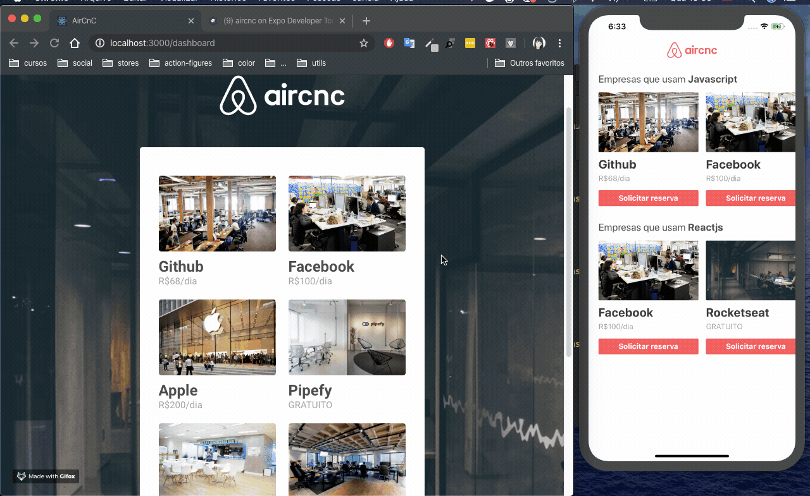

# ProjectAircnc
Project based on Airbnb

### **Used Packages:**  *React-native*.
### **Used Packages:**  *Reactjs*.
### **Used Packages:**  *Nodejs*.
### **Used Packages:**  *Expo*.

## Install
  - install package in each folder:
  ```
  yarn/npm i
  ```
  - Run application on mobile:
  ```
  yarn start
  ```
  - Run application on web:
  ```
  yarn start
  ```
  - Run application on server:
  ```
  yarn dev
  ```
## Attention

Inside the mobile/src/services/api.js folder. Change the value of the **baseURL** variable to your Expo url.

> baseURL: **'<URL_EXPO>'**

Inside the frontend/src/services/api.js folder. Change the value of the **baseURL** variable to your server url.

> baseURL: **'<URL_SERVER>'**

Inside the backend/src/server.js folder. Change the value of the **YOUR_URL_DATABASE** variable to your Mongodb url.

> mongoose.connect(**'<YOUR_URL_DATABASE>'**, {

## Demo



## License

This project is licensed under the MIT License - see the [LICENSE.md](LICENSE.md) file for details
